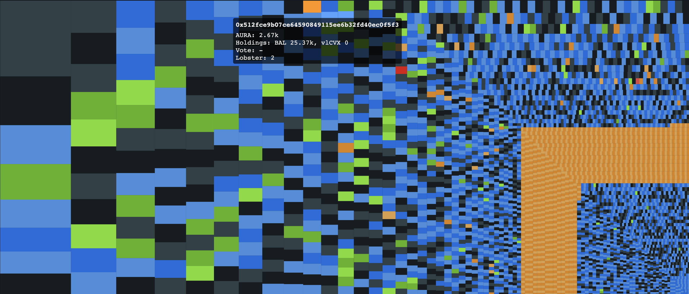

# Aura Token Allocation

Scrapes data sources for token holders and creates Merkle drop allocations scaled for a fair distribution.

---



A visualisation of the allocations; each box represents an address receiving Aura.

---

## Methodology

- Get validated redirection files
- Fetch data
  - Dune queries for vlCVX and BAL holders
  - Balancer Pool LPs from Balancer subgraphs
  - Votes from Balancer Snapshot
- Create Merkle Drop
  - Filter allowed addresses (EOAs and Gnosis Safes)
  - Apply redirections
  - Remove claims under a given amount of Aura (prevent uneconomic claims)
  - Rescale allocations with a power distribution (reducing the Gini coefficients)
- Create artifacts
  - List of accounts
  - List of allocations
  - Report with Merkle root
  - Interactive tree map to visualise allocations

---

## Quick start

```shell

# Install
pnpm install

# Run from saved snapshot data:
pnpm start

# Optionally, run with config:
pnpm start --cache true --scaleExponentBal 0.75 --scaleExponentVlcvx 0.75 --minAuraRewardBalancer 50

# Run without using cached data. This will take some time.
# Caution: Many (throttled) requests to Infura, Dune Analytics and The Graph will be made.
# You will also need to set env vars in .env, for API keys and so on.
cp .env.example .env # fill in .env
pnpm start --cache false

```

## Configuration

- `cache`: Whether to use cached query results
- `scaleExponentBal`: Exponent used to rescale allocations (BAL)
- `scaleExponentVlcvx`: Exponent used to rescale allocations (vlCVX)
- `cutoffMainnet`: Snapshot cutoff block for Mainnet
- `cutoffPolygon`: Snapshot cutoff block for Polygon
- `cutoffArbitrum`: Snapshot cutoff block for Arbitrum
- `minAuraRewardBalancer`: Minimum reward size in $AURA for Balancer
- `minAuraRewardConvex`: Minimum reward size in $AURA for Convex
- `balancerVoteProposalId`: Proposal ID from Snapshot used for the Balancer vote query
- `balancerVoteMultiplier`: Balance multiplier given to yes voters
